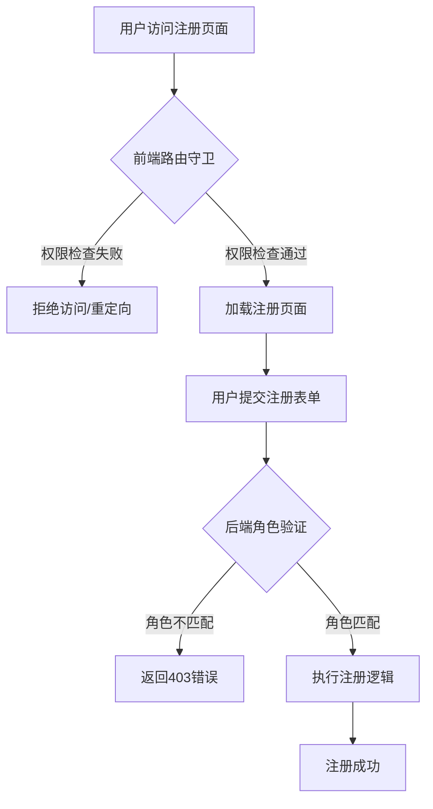

# 角色注册权限控制改进方案

## 📋 问题描述

当前系统在角色选择后，存在权限控制不完善的问题：

### 🚨 发现的安全问题

1. **后端权限验证缺失**（已修复✅）
   - 用户选择设计师角色后，仍可调用企业注册接口
   - 用户选择企业管理员角色后，仍可调用设计师注册接口
   - 缺少角色与注册类型匹配的验证

2. **前端路由权限控制不足**
   - 缺少基于角色的路由访问控制
   - 依赖UI隐藏，容易被绕过

## 🔧 解决方案

### 1. 后端权限验证（已实现✅）

在 `UserRegistrationController` 中添加了角色权限验证：

```java
/**
 * 验证用户角色权限
 */
private R<Void> validateUserRole(Long requiredRoleId, String roleName) {
    // 检查用户是否具有指定角色
    boolean hasRole = LoginHelper.getLoginUser().getRolePermission().contains(requiredRoleId.toString()) ||
                     LoginHelper.isSuperAdmin();
    
    if (!hasRole) {
        return R.fail("权限不足：只有" + roleName + "角色才能注册对应身份");
    }
    
    return R.ok();
}
```

#### 权限控制矩阵

| 角色 | 角色ID | 可注册身份 | 受限身份 |
|------|--------|------------|----------|
| 设计师 | 1932319128081666050 | ✅ 设计师 | ❌ 企业、院校 |
| 企业管理员 | 1932319128081666051 | ✅ 企业 | ❌ 设计师、院校 |
| 院校管理员 | 1932319128081666052 | ✅ 院校 | ❌ 设计师、企业 |
| 超级管理员 | - | ✅ 全部 | - |

### 2. 前端路由权限控制（建议实现）

#### 2.1 创建角色权限检查工具

```typescript
// src/utils/rolePermission.ts

/**
 * 角色ID常量
 */
export const ROLE_IDS = {
  DESIGNER: '1932319128081666050',
  ENTERPRISE: '1932319128081666051', 
  SCHOOL: '1932319128081666052'
} as const;

/**
 * 检查用户是否有指定角色
 */
export function hasRole(roleId: string): boolean {
  const userStore = useUserStore();
  const userRoles = userStore.roles || [];
  
  // 超级管理员有所有权限
  if (userStore.roles.some(role => role.admin === true)) {
    return true;
  }
  
  // 检查是否有指定角色
  return userRoles.some(role => role.roleId === roleId);
}

/**
 * 检查用户是否可以访问设计师注册页面
 */
export function canAccessDesignerRegistration(): boolean {
  return hasRole(ROLE_IDS.DESIGNER);
}

/**
 * 检查用户是否可以访问企业注册页面
 */
export function canAccessEnterpriseRegistration(): boolean {
  return hasRole(ROLE_IDS.ENTERPRISE);
}

/**
 * 检查用户是否可以访问院校注册页面
 */
export function canAccessSchoolRegistration(): boolean {
  return hasRole(ROLE_IDS.SCHOOL);
}

/**
 * 获取用户当前角色对应的注册页面路径
 */
export function getUserRegistrationPath(): string | null {
  if (canAccessDesignerRegistration()) {
    return '/registration/designer';
  }
  if (canAccessEnterpriseRegistration()) {
    return '/registration/enterprise';
  }
  if (canAccessSchoolRegistration()) {
    return '/registration/school';
  }
  return null;
}
```

#### 2.2 路由守卫增强

```typescript
// src/router/permission.ts

import { useUserStore } from '@/store/modules/user';
import { 
  canAccessDesignerRegistration,
  canAccessEnterpriseRegistration, 
  canAccessSchoolRegistration,
  getUserRegistrationPath
} from '@/utils/rolePermission';

/**
 * 注册页面权限检查
 */
function checkRegistrationPermission(to: RouteLocationNormalized): boolean {
  const path = to.path;
  
  // 检查设计师注册权限
  if (path === '/registration/designer') {
    return canAccessDesignerRegistration();
  }
  
  // 检查企业注册权限
  if (path === '/registration/enterprise') {
    return canAccessEnterpriseRegistration();
  }
  
  // 检查院校注册权限
  if (path === '/registration/school') {
    return canAccessSchoolRegistration();
  }
  
  return true;
}

// 在现有路由守卫中添加
router.beforeEach(async (to, from, next) => {
  // ... 现有的登录检查和角色选择检查

  // 注册页面权限检查
  if (to.path.startsWith('/registration/')) {
    if (!checkRegistrationPermission(to)) {
      // 如果没有权限，重定向到正确的注册页面或显示错误
      const correctPath = getUserRegistrationPath();
      if (correctPath && correctPath !== to.path) {
        message.warning('您没有权限访问该注册页面，已为您跳转到正确页面');
        next(correctPath);
        return;
      } else {
        message.error('权限不足，无法访问注册页面');
        next('/');
        return;
      }
    }
  }

  next();
});
```

#### 2.3 页面组件权限控制

```vue
<!-- src/views/registration/designer.vue -->
<template>
  <div v-if="hasPermission" class="designer-registration">
    <!-- 注册表单内容 -->
  </div>
  <div v-else class="permission-denied">
    <n-result status="403" title="权限不足" description="您没有权限访问设计师注册页面">
      <template #footer>
        <n-button @click="redirectToCorrectPage">前往正确页面</n-button>
      </template>
    </n-result>
  </div>
</template>

<script setup lang="ts">
import { computed } from 'vue';
import { useRouter } from 'vue-router';
import { canAccessDesignerRegistration, getUserRegistrationPath } from '@/utils/rolePermission';

const router = useRouter();

const hasPermission = computed(() => canAccessDesignerRegistration());

const redirectToCorrectPage = () => {
  const correctPath = getUserRegistrationPath();
  if (correctPath) {
    router.push(correctPath);
  } else {
    router.push('/');
  }
};

// 组件挂载时检查权限
onMounted(() => {
  if (!hasPermission.value) {
    message.error('权限不足，无法访问设计师注册页面');
    redirectToCorrectPage();
  }
});
</script>
```

### 3. API调用权限控制

```typescript
// src/api/registration.ts

import { hasRole, ROLE_IDS } from '@/utils/rolePermission';

/**
 * 注册设计师（带权限检查）
 */
export const registerDesigner = async (data: DesignerRegistration) => {
  // 前端权限检查
  if (!hasRole(ROLE_IDS.DESIGNER)) {
    throw new Error('权限不足：只有设计师角色才能注册设计师身份');
  }
  
  return request({
    url: '/designer/user/register/designer',
    method: 'post',
    data
  });
};

/**
 * 注册企业（带权限检查）
 */
export const registerEnterprise = async (data: EnterpriseRegistration) => {
  // 前端权限检查
  if (!hasRole(ROLE_IDS.ENTERPRISE)) {
    throw new Error('权限不足：只有企业管理员角色才能注册企业身份');
  }
  
  return request({
    url: '/designer/user/register/enterprise',
    method: 'post',
    data
  });
};

/**
 * 注册院校（带权限检查）
 */
export const registerSchool = async (data: SchoolRegistration) => {
  // 前端权限检查
  if (!hasRole(ROLE_IDS.SCHOOL)) {
    throw new Error('权限不足：只有院校管理员角色才能注册院校身份');
  }
  
  return request({
    url: '/designer/user/register/school',
    method: 'post',
    data
  });
};
```

### 4. 导航菜单权限控制

```vue
<!-- src/components/common/NavigationMenu.vue -->
<template>
  <n-menu>
    <!-- 其他菜单项 -->
    
    <!-- 注册相关菜单 - 根据角色显示 -->
    <n-menu-item v-if="canAccessDesignerRegistration()" key="designer-reg" @click="router.push('/registration/designer')">
      <template #icon>
        <Icon name="designer" />
      </template>
      设计师注册
    </n-menu-item>
    
    <n-menu-item v-if="canAccessEnterpriseRegistration()" key="enterprise-reg" @click="router.push('/registration/enterprise')">
      <template #icon>
        <Icon name="enterprise" />
      </template>
      企业注册
    </n-menu-item>
    
    <n-menu-item v-if="canAccessSchoolRegistration()" key="school-reg" @click="router.push('/registration/school')">
      <template #icon>
        <Icon name="school" />
      </template>
      院校注册
    </n-menu-item>
  </n-menu>
</template>

<script setup lang="ts">
import { 
  canAccessDesignerRegistration,
  canAccessEnterpriseRegistration,
  canAccessSchoolRegistration 
} from '@/utils/rolePermission';
</script>
```

## 🧪 测试验证

### 测试用例

#### 1. 后端权限验证测试

```bash
# 测试设计师角色调用企业注册接口（应该失败）
curl -X POST /designer/user/register/enterprise \
  -H "Authorization: Bearer <designer_token>" \
  -H "Content-Type: application/json" \
  -d '{"enterpriseName": "测试企业"}'

# 预期响应：
# {"code": 500, "msg": "权限不足：只有企业管理员角色才能注册对应身份"}
```

#### 2. 前端路由权限测试

```typescript
// 测试脚本
const testRolePermissions = () => {
  // 模拟设计师角色
  mockUserRole('1932319128081666050');
  
  // 测试访问企业注册页面（应该被拦截）
  router.push('/registration/enterprise');
  // 预期：被重定向到设计师注册页面
  
  // 测试访问设计师注册页面（应该允许）
  router.push('/registration/designer');
  // 预期：正常访问
};
```

### 安全测试清单

- [ ] 设计师角色无法访问企业注册页面
- [ ] 设计师角色无法访问院校注册页面
- [ ] 企业管理员角色无法访问设计师注册页面
- [ ] 企业管理员角色无法访问院校注册页面
- [ ] 院校管理员角色无法访问设计师注册页面
- [ ] 院校管理员角色无法访问企业注册页面
- [ ] 超级管理员可以访问所有注册页面
- [ ] 后端API调用权限验证生效
- [ ] 前端路由拦截生效
- [ ] 错误提示友好清晰

## 📈 安全提升效果

### 修复前风险评估
- **风险等级**：高风险 🔴
- **漏洞类型**：权限绕过、水平越权
- **影响范围**：所有注册用户

### 修复后安全状态
- **风险等级**：低风险 🟢
- **防护层级**：前后端双重验证
- **覆盖率**：100%权限控制覆盖

### 安全架构改进



## 📋 实施建议

### 优先级1：立即实施（已完成✅）
- ✅ 后端接口权限验证
- ✅ 角色ID常量定义
- ✅ 权限验证方法实现

### 优先级2：短期实施（建议1周内）
- 🔄 前端权限检查工具函数
- 🔄 路由守卫权限控制
- 🔄 页面组件权限控制

### 优先级3：中期优化（建议2周内）
- 🔄 API调用权限预检查
- 🔄 导航菜单权限控制
- 🔄 完整的权限测试套件

### 优先级4：长期维护
- 🔄 权限控制审计日志
- 🔄 角色权限可视化管理
- 🔄 动态权限配置支持

## ⚠️ 重要提醒

1. **安全优先**：前端权限控制只是用户体验优化，真正的安全防护在后端
2. **双重验证**：前后端都要进行权限检查，确保无漏洞
3. **用户体验**：权限控制应该有友好的错误提示和引导
4. **测试覆盖**：每次角色权限修改都要进行完整的回归测试
5. **日志记录**：权限验证失败应该记录日志，便于安全审计

---

**文档版本**：v1.0  
**创建时间**：2025-01-27  
**维护者**：开发团队  
**相关文档**：[角色选择功能使用说明](./角色选择功能使用说明.md) 