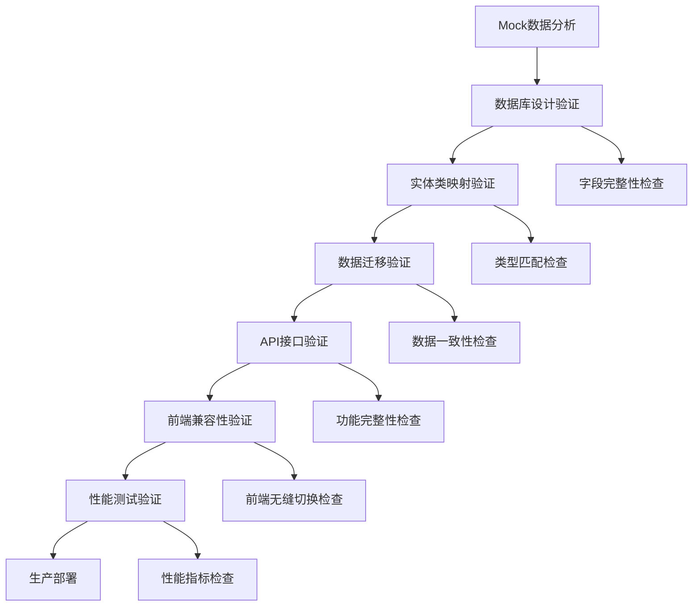

# 院校Mock数据API完整实施方案

## 📋 项目概述

基于[院校Mock数据API设计方案-最终版](../frontend/院校Mock数据API设计方案-最终版.md)，本文档详细规划了从Mock数据向真实后端API迁移的完整实施方案，包含数据库设计、接口规范、实施计划和测试策略。

### 目标
- 实现100%覆盖Mock数据的后端API接口
- 确保前端零修改切换到后端API
- 保持数据结构完全一致
- 建立完整的院校数据生态系统

### 核心原则
- **渐进式开发**：分阶段实施，确保每阶段独立可用
- **向后兼容**：保持现有接口不变
- **数据一致性**：严格遵循API设计规范
- **性能优化**：合理的缓存和查询策略

## 📊 Mock数据结构分析

### Mock数据完整性统计
根据`mockSchools.ts`文件分析，包含以下完整数据：

| 数据类型 | 院校数量 | 数据完整性 | 字段数量 | 特殊说明 |
|---------|----------|------------|----------|----------|
| 基础院校信息 | 8所 | 100% | 24个字段 | 包含状态、时间戳等 |
| 专业分类 | 8所 | 100% | 4个字段/专业 | 每校4个专业分类 |
| 课程体系 | 8所 | 100% | 2个字段/组 | 每校4个课程组 |
| 师资统计 | 8所 | 100% | 5个字段 | 详细统计数据 |
| 代表性教师 | 8所 | 100% | 4个字段/教师 | 每校3名教师 |
| 就业统计 | 8所 | 100% | 5个字段 | 百分比和描述 |
| 代表性雇主 | 8所 | 100% | 3个字段/雇主 | 每校8个雇主 |
| 图表数据 | 8所 | 100% | 3个字段 | 复杂JSON结构 |
| 学生成果 | 8所 | 100% | 5个字段 | 数量统计 |
| 获奖趋势 | 8所 | 100% | 4个字段 | 6年数据 |
| 获奖作品 | 8所 | 100% | 4个字段/作品 | 每校3个作品 |
| 卡片统计 | 8所 | 100% | 4个字段 | 复杂嵌套结构 |

### 数据特点分析

#### 1. 院校类型分布
- **综合类大学**：清华大学、同济大学、江南大学、湖南大学
- **艺术类院校**：中央美术学院、中国美术学院、广州美术学院  
- **工科院校**：北京理工大学

#### 2. 地域分布特点
- **一线城市**：北京(3所)、上海(1所)、广州(1所)
- **新一线城市**：杭州(1所)、无锡(1所)、长沙(1所)
- **覆盖区域**：华北、华东、华南、华中

#### 3. 数据复杂度分析
- **简单字段**：基础信息、统计数字
- **JSON字段**：技能列表、课程数组、图表数据
- **关联数据**：按院校ID分组的复杂嵌套结构
- **格式化数据**：百分比、评分、货币格式

### Mock数据与数据库字段映射

#### 基础院校信息映射
```typescript
// Mock数据结构
interface School {
  id: number                    → school_id (BIGINT)
  schoolName: string           → school_name (VARCHAR)
  schoolType: SchoolType       → school_type (VARCHAR)
  location: string             → location (VARCHAR)
  province: string             → province (VARCHAR)
  city: string                 → city (VARCHAR)
  level: SchoolLevel           → level (VARCHAR)
  ranking: number              → ranking (INT)
  description: string          → description (TEXT)
  logo: string                 → logo (VARCHAR)
  website: string              → website (VARCHAR)
  address: string              → address (VARCHAR)
  phone: string                → phone (VARCHAR)
  email: string                → email (VARCHAR)
  totalStudents: number        → total_students (INT)
  totalTeachers: number        → total_teachers (INT)
  facultyCount: number         → faculty_count (INT)
  majorCount: number           → major_count (INT)
  status: string               → status (VARCHAR)
  isKey: boolean               → is_key (TINYINT)
  is985: boolean               → is_985 (TINYINT)
  is211: boolean               → is_211 (TINYINT)
  isDoubleFirst: boolean       → is_double_first (TINYINT)
  createdAt: string            → create_time (DATETIME)
  updatedAt: string            → update_time (DATETIME)
}
```

#### 复杂数据结构处理策略
```typescript
// 1. 技能数组 → JSON字段
skills: string[] → skills JSON

// 2. 课程数组 → JSON字段
courses: string[] → courses JSON

// 3. 图表数据 → 分解存储
{
  industryData: ChartItem[]    → industry_data JSON
  salaryData: number[]         → salary_data JSON
  salaryLabels: string[]       → salary_labels JSON
}

// 4. 优势专业按类型分类 → JSON字段
advantagePrograms: Record<string, string[]> → advantage_programs JSON
```

## 🔍 现状分析

### ✅ 已有功能
- 基础院校管理（增删改查、权限控制）
- 院校详情展示
- 学生管理（院校学生列表查询）
- 专业管理（院校专业列表查询）
- 成果管理（院校获奖成果查询）
- 收藏功能（院校收藏/取消收藏）
- 统计功能（就业统计、企业分布统计）

### ❌ 缺失功能
1. **扩展的院校实体字段**（schoolType、province、city、level等）
2. **专业分类数据**接口和相关实体
3. **课程体系数据**接口和相关实体
4. **师资统计数据**接口和相关实体
5. **代表性教师数据**接口和相关实体
6. **就业图表数据**接口扩展
7. **学生成果统计**接口扩展
8. **获奖趋势数据**接口和相关实体
9. **获奖作品数据**接口和相关实体
10. **卡片统计数据**接口
11. **格式化数据**接口
12. **综合数据**接口

## 📅 实施计划

### 时间安排
| 阶段 | 工作内容 | 预计时间 | 依赖关系 |
|------|----------|----------|----------|
| 第一阶段 | 数据库扩展 | 1天 | - |
| 第二阶段 | 实体类扩展 | 1天 | 第一阶段 |
| 第三阶段 | 数据访问层扩展 | 2天 | 第二阶段 |
| 第四阶段 | 服务层扩展 | 2天 | 第三阶段 |
| 第五阶段 | 控制器扩展 | 2天 | 第四阶段 |
| 第六阶段 | 权限和安全 | 1天 | 第五阶段 |
| 第七阶段 | 数据初始化 | 1天 | 第六阶段 |
| 第八阶段 | 测试和优化 | 2天 | 第七阶段 |

**总计**：12天

## 🗃️ 第一阶段：数据库设计与扩展

### 1.1 扩展现有院校表结构

**原有字段保持不变，新增以下字段：**

| 字段名 | 类型 | 默认值 | 注释 |
|--------|------|--------|------|
| province | VARCHAR(50) | NULL | 省份 |
| city | VARCHAR(50) | NULL | 城市 |
| location | VARCHAR(100) | NULL | 完整地址 |
| ranking | INT | NULL | 院校排名 |
| total_students | INT | 0 | 学生总数 |
| total_teachers | INT | 0 | 教师总数 |
| faculty_count | INT | 0 | 院系数量 |
| major_count | INT | 0 | 专业数量 |
| is_key | TINYINT(1) | 0 | 是否重点院校 |
| is_985 | TINYINT(1) | 0 | 是否985院校 |
| is_211 | TINYINT(1) | 0 | 是否211院校 |
| is_double_first | TINYINT(1) | 0 | 是否双一流院校 |

```sql
-- 扩展 des_school 表
ALTER TABLE des_school 
ADD COLUMN province VARCHAR(50) COMMENT '省份',
ADD COLUMN city VARCHAR(50) COMMENT '城市',
ADD COLUMN location VARCHAR(100) COMMENT '完整地址',
ADD COLUMN ranking INT COMMENT '院校排名',
ADD COLUMN total_students INT DEFAULT 0 COMMENT '学生总数',
ADD COLUMN total_teachers INT DEFAULT 0 COMMENT '教师总数',
ADD COLUMN faculty_count INT DEFAULT 0 COMMENT '院系数量',
ADD COLUMN major_count INT DEFAULT 0 COMMENT '专业数量',
ADD COLUMN is_key TINYINT(1) DEFAULT 0 COMMENT '是否重点院校',
ADD COLUMN is_985 TINYINT(1) DEFAULT 0 COMMENT '是否985院校',
ADD COLUMN is_211 TINYINT(1) DEFAULT 0 COMMENT '是否211院校',
ADD COLUMN is_double_first TINYINT(1) DEFAULT 0 COMMENT '是否双一流院校',
ADD COLUMN logo VARCHAR(255) COMMENT '院校logo图片URL',
ADD COLUMN website VARCHAR(255) COMMENT '院校官网地址',
ADD COLUMN address VARCHAR(255) COMMENT '院校详细地址',
ADD COLUMN phone VARCHAR(20) COMMENT '联系电话',
ADD COLUMN email VARCHAR(100) COMMENT '联系邮箱';

-- 修改现有字段，使其符合API设计
ALTER TABLE des_school 
MODIFY COLUMN school_type VARCHAR(20) COMMENT '院校类型：COMPREHENSIVE/ART/ENGINEERING/NORMAL/FINANCE',
MODIFY COLUMN level VARCHAR(20) COMMENT '办学层次：UNDERGRADUATE/GRADUATE/VOCATIONAL';
```

### 1.2 创建新业务表

#### 专业分类表
```sql
CREATE TABLE des_school_major_category (
    id BIGINT PRIMARY KEY AUTO_INCREMENT,
    school_id BIGINT NOT NULL COMMENT '院校ID',
    name VARCHAR(100) NOT NULL COMMENT '专业名称',
    icon VARCHAR(50) COMMENT '图标',
    description TEXT COMMENT '专业描述',
    skills JSON COMMENT '技能列表',
    create_by VARCHAR(64) DEFAULT '',
    create_time DATETIME DEFAULT CURRENT_TIMESTAMP,
    update_by VARCHAR(64) DEFAULT '',
    update_time DATETIME DEFAULT CURRENT_TIMESTAMP ON UPDATE CURRENT_TIMESTAMP,
    FOREIGN KEY (school_id) REFERENCES des_school(school_id) ON DELETE CASCADE
) COMMENT='院校专业分类表';
```

#### 课程体系表
```sql
CREATE TABLE des_school_course_group (
    id BIGINT PRIMARY KEY AUTO_INCREMENT,
    school_id BIGINT NOT NULL COMMENT '院校ID',
    name VARCHAR(100) NOT NULL COMMENT '课程组名称',
    courses JSON COMMENT '课程列表',
    create_by VARCHAR(64) DEFAULT '',
    create_time DATETIME DEFAULT CURRENT_TIMESTAMP,
    update_by VARCHAR(64) DEFAULT '',
    update_time DATETIME DEFAULT CURRENT_TIMESTAMP ON UPDATE CURRENT_TIMESTAMP,
    FOREIGN KEY (school_id) REFERENCES des_school(school_id) ON DELETE CASCADE
) COMMENT='院校课程体系表';
```

#### 师资统计表
```sql
CREATE TABLE des_school_faculty_stats (
    id BIGINT PRIMARY KEY AUTO_INCREMENT,
    school_id BIGINT NOT NULL UNIQUE COMMENT '院校ID',
    total_faculty INT DEFAULT 0 COMMENT '师资总数',
    professors INT DEFAULT 0 COMMENT '教授人数',
    doctor_degree INT DEFAULT 0 COMMENT '博士学位人数',
    overseas_background INT DEFAULT 0 COMMENT '海外背景人数',
    description TEXT COMMENT '师资描述',
    create_by VARCHAR(64) DEFAULT '',
    create_time DATETIME DEFAULT CURRENT_TIMESTAMP,
    update_by VARCHAR(64) DEFAULT '',
    update_time DATETIME DEFAULT CURRENT_TIMESTAMP ON UPDATE CURRENT_TIMESTAMP,
    FOREIGN KEY (school_id) REFERENCES des_school(school_id) ON DELETE CASCADE
) COMMENT='院校师资统计表';
```

#### 其他业务表
```sql
-- 代表性教师表
CREATE TABLE des_school_teacher (
    id BIGINT PRIMARY KEY AUTO_INCREMENT,
    school_id BIGINT NOT NULL COMMENT '院校ID',
    name VARCHAR(50) NOT NULL COMMENT '教师姓名',
    title VARCHAR(50) COMMENT '职称',
    expertise JSON COMMENT '专业领域',
    description TEXT COMMENT '教师描述',
    create_by VARCHAR(64) DEFAULT '',
    create_time DATETIME DEFAULT CURRENT_TIMESTAMP,
    update_by VARCHAR(64) DEFAULT '',
    update_time DATETIME DEFAULT CURRENT_TIMESTAMP ON UPDATE CURRENT_TIMESTAMP,
    FOREIGN KEY (school_id) REFERENCES des_school(school_id) ON DELETE CASCADE
) COMMENT='院校代表性教师表';

-- 就业统计表
CREATE TABLE des_school_employment_stats (
    id BIGINT PRIMARY KEY AUTO_INCREMENT,
    school_id BIGINT NOT NULL UNIQUE COMMENT '院校ID',
    employment_rate VARCHAR(10) COMMENT '就业率',
    average_salary VARCHAR(10) COMMENT '平均薪资',
    further_study_rate VARCHAR(10) COMMENT '深造率',
    overseas_employment_rate VARCHAR(10) COMMENT '海外就业率',
    description TEXT COMMENT '就业描述',
    create_by VARCHAR(64) DEFAULT '',
    create_time DATETIME DEFAULT CURRENT_TIMESTAMP,
    update_by VARCHAR(64) DEFAULT '',
    update_time DATETIME DEFAULT CURRENT_TIMESTAMP ON UPDATE CURRENT_TIMESTAMP,
    FOREIGN KEY (school_id) REFERENCES des_school(school_id) ON DELETE CASCADE
) COMMENT='院校就业统计表';

-- 代表性雇主表
CREATE TABLE des_school_employer (
    id BIGINT PRIMARY KEY AUTO_INCREMENT,
    school_id BIGINT NOT NULL COMMENT '院校ID',
    name VARCHAR(100) NOT NULL COMMENT '雇主名称',
    industry VARCHAR(50) COMMENT '行业类型',
    create_by VARCHAR(64) DEFAULT '',
    create_time DATETIME DEFAULT CURRENT_TIMESTAMP,
    update_by VARCHAR(64) DEFAULT '',
    update_time DATETIME DEFAULT CURRENT_TIMESTAMP ON UPDATE CURRENT_TIMESTAMP,
    FOREIGN KEY (school_id) REFERENCES des_school(school_id) ON DELETE CASCADE
) COMMENT='院校代表性雇主表';

-- 就业图表数据表
CREATE TABLE des_school_chart_data (
    id BIGINT PRIMARY KEY AUTO_INCREMENT,
    school_id BIGINT NOT NULL UNIQUE COMMENT '院校ID',
    industry_data JSON COMMENT '行业分布数据',
    salary_data JSON COMMENT '薪资分布数据',
    salary_labels JSON COMMENT '薪资区间标签',
    create_by VARCHAR(64) DEFAULT '',
    create_time DATETIME DEFAULT CURRENT_TIMESTAMP,
    update_by VARCHAR(64) DEFAULT '',
    update_time DATETIME DEFAULT CURRENT_TIMESTAMP ON UPDATE CURRENT_TIMESTAMP,
    FOREIGN KEY (school_id) REFERENCES des_school(school_id) ON DELETE CASCADE
) COMMENT='院校就业图表数据表';

-- 学生成果统计表
CREATE TABLE des_school_achievement_stats (
    id BIGINT PRIMARY KEY AUTO_INCREMENT,
    school_id BIGINT NOT NULL UNIQUE COMMENT '院校ID',
    international_awards INT DEFAULT 0 COMMENT '国际奖项数量',
    national_awards INT DEFAULT 0 COMMENT '国家级奖项数量',
    provincial_awards INT DEFAULT 0 COMMENT '省级奖项数量',
    patents INT DEFAULT 0 COMMENT '专利数量',
    description TEXT COMMENT '成果描述',
    create_by VARCHAR(64) DEFAULT '',
    create_time DATETIME DEFAULT CURRENT_TIMESTAMP,
    update_by VARCHAR(64) DEFAULT '',
    update_time DATETIME DEFAULT CURRENT_TIMESTAMP ON UPDATE CURRENT_TIMESTAMP,
    FOREIGN KEY (school_id) REFERENCES des_school(school_id) ON DELETE CASCADE
) COMMENT='院校学生成果统计表';

-- 获奖趋势数据表
CREATE TABLE des_school_trend_data (
    id BIGINT PRIMARY KEY AUTO_INCREMENT,
    school_id BIGINT NOT NULL UNIQUE COMMENT '院校ID',
    years JSON COMMENT '年份数组',
    international_data JSON COMMENT '国际奖项数据',
    national_data JSON COMMENT '国家级奖项数据',
    provincial_data JSON COMMENT '省级奖项数据',
    create_by VARCHAR(64) DEFAULT '',
    create_time DATETIME DEFAULT CURRENT_TIMESTAMP,
    update_by VARCHAR(64) DEFAULT '',
    update_time DATETIME DEFAULT CURRENT_TIMESTAMP ON UPDATE CURRENT_TIMESTAMP,
    FOREIGN KEY (school_id) REFERENCES des_school(school_id) ON DELETE CASCADE
) COMMENT='院校获奖趋势数据表';

-- 获奖作品表
CREATE TABLE des_school_award_work (
    id BIGINT PRIMARY KEY AUTO_INCREMENT,
    school_id BIGINT NOT NULL COMMENT '院校ID',
    title VARCHAR(200) NOT NULL COMMENT '作品标题',
    award VARCHAR(100) COMMENT '奖项名称',
    description TEXT COMMENT '作品描述',
    create_by VARCHAR(64) DEFAULT '',
    create_time DATETIME DEFAULT CURRENT_TIMESTAMP,
    update_by VARCHAR(64) DEFAULT '',
    update_time DATETIME DEFAULT CURRENT_TIMESTAMP ON UPDATE CURRENT_TIMESTAMP,
    FOREIGN KEY (school_id) REFERENCES des_school(school_id) ON DELETE CASCADE
) COMMENT='院校获奖作品表';

-- 卡片统计数据表
CREATE TABLE des_school_card_stats (
    id BIGINT PRIMARY KEY AUTO_INCREMENT,
    school_id BIGINT NOT NULL UNIQUE COMMENT '院校ID',
    employment_rates JSON COMMENT '就业率数组',
    faculty_strengths JSON COMMENT '师资力量评分数组',
    student_scores JSON COMMENT '学生评分数组',
    advantage_programs JSON COMMENT '优势专业按院校类型分类',
    create_by VARCHAR(64) DEFAULT '',
    create_time DATETIME DEFAULT CURRENT_TIMESTAMP,
    update_by VARCHAR(64) DEFAULT '',
    update_time DATETIME DEFAULT CURRENT_TIMESTAMP ON UPDATE CURRENT_TIMESTAMP,
    FOREIGN KEY (school_id) REFERENCES des_school(school_id) ON DELETE CASCADE
) COMMENT='院校卡片统计数据表';
```

### 1.3 索引设计

```sql
-- 院校表扩展索引
CREATE INDEX idx_des_school_province_city ON des_school(province, city);
CREATE INDEX idx_des_school_type_level ON des_school(school_type, level);
CREATE INDEX idx_des_school_ranking ON des_school(ranking);
CREATE INDEX idx_des_school_flags ON des_school(is_key, is_985, is_211, is_double_first);

-- 各业务表的外键索引
CREATE INDEX idx_major_category_school ON des_school_major_category(school_id);
CREATE INDEX idx_course_group_school ON des_school_course_group(school_id);
CREATE INDEX idx_teacher_school ON des_school_teacher(school_id);
CREATE INDEX idx_employer_school ON des_school_employer(school_id);
CREATE INDEX idx_award_work_school ON des_school_award_work(school_id);
```

## 📝 第二阶段：实体类扩展

### 2.1 扩展School实体类

在 `School.java` 中新增字段：

```java
/**
 * 省份
 */
@Schema(description = "省份", example = "北京市")
private String province;

/**
 * 城市
 */
@Schema(description = "城市", example = "海淀区")
private String city;

/**
 * 完整地址
 */
@Schema(description = "完整地址", example = "北京市海淀区清华园1号")
private String location;

/**
 * 院校排名
 */
@Schema(description = "院校排名", example = "1")
private Integer ranking;

/**
 * 学生总数
 */
@Schema(description = "学生总数", example = "30000")
private Integer totalStudents;

/**
 * 教师总数
 */
@Schema(description = "教师总数", example = "2000")
private Integer totalTeachers;

/**
 * 院系数量
 */
@Schema(description = "院系数量", example = "20")
private Integer facultyCount;

/**
 * 专业数量
 */
@Schema(description = "专业数量", example = "80")
private Integer majorCount;

/**
 * 是否重点院校
 */
@Schema(description = "是否重点院校", example = "true")
private Boolean isKey;

/**
 * 是否985院校
 */
@Schema(description = "是否985院校", example = "true")
private Boolean is985;

/**
 * 是否211院校
 */
@Schema(description = "是否211院校", example = "true")
private Boolean is211;

/**
 * 是否双一流院校
 */
@Schema(description = "是否双一流院校", example = "true")
private Boolean isDoubleFirst;

/**
 * 院校logo图片URL
 */
@Schema(description = "院校logo图片URL", example = "https://example.com/logo.png")
private String logo;

/**
 * 院校官网地址
 */
@Schema(description = "院校官网地址", example = "https://www.tsinghua.edu.cn")
private String website;

/**
 * 院校详细地址
 */
@Schema(description = "院校详细地址", example = "北京市海淀区清华园1号")
private String address;

/**
 * 联系电话
 */
@Schema(description = "联系电话", example = "010-62782051")
private String phone;

/**
 * 联系邮箱
 */
@Schema(description = "联系邮箱", example = "info@tsinghua.edu.cn")
private String email;
```

### 2.2 新增实体类列表

需要创建以下实体类：
- `MajorCategory.java` - 专业分类
- `CourseGroup.java` - 课程体系
- `FacultyStats.java` - 师资统计
- `Teacher.java` - 代表性教师
- `EmploymentStats.java` - 就业统计
- `Employer.java` - 代表性雇主
- `ChartData.java` - 图表数据
- `AchievementStats.java` - 学生成果统计
- `TrendData.java` - 获奖趋势数据
- `AwardWork.java` - 获奖作品
- `SchoolCardStats.java` - 卡片统计数据
- `SchoolFullInfo.java` - 综合数据（VO类）

## 🔗 第三阶段：数据访问层扩展

### 3.1 创建Mapper接口

每个新实体类对应一个Mapper接口，继承 `BaseMapperPlus` 接口：

```java
@Mapper
public interface MajorCategoryMapper extends BaseMapperPlus<MajorCategory, MajorCategory> {
    
    /**
     * 根据院校ID查询专业分类列表
     */
    List<MajorCategory> selectBySchoolId(Long schoolId);
}
```

### 3.2 扩展SchoolMapper

在 `SchoolMapper.java` 中新增查询方法：

```java
/**
 * 根据筛选条件查询院校列表（支持新字段筛选）
 */
Page<School> selectSchoolListWithExtendedFilters(
    @Param("school") School school,
    @Param("province") String province,
    @Param("city") String city,
    @Param("schoolType") String schoolType,
    @Param("level") String level,
    @Param("isKey") Boolean isKey,
    @Param("is985") Boolean is985,
    @Param("is211") Boolean is211,
    @Param("isDoubleFirst") Boolean isDoubleFirst,
    Page<School> page
);
```

## 🛠️ 第四阶段：服务层扩展

### 4.1 创建服务接口

为每个业务实体创建对应的服务接口：

```java
public interface IMajorCategoryService extends IService<MajorCategory> {
    
    /**
     * 根据院校ID获取专业分类列表
     */
    List<MajorCategory> getMajorCategoriesBySchoolId(Long schoolId);
    
    /**
     * 批量保存专业分类
     */
    Boolean saveMajorCategories(Long schoolId, List<MajorCategory> categories);
}
```

### 4.2 扩展SchoolService

在 `ISchoolService.java` 中新增方法：

```java
// 专业分类相关
List<MajorCategory> getMajorCategories(Long schoolId);

// 课程体系相关
List<CourseGroup> getCourseSystem(Long schoolId);

// 师资相关
FacultyStats getFacultyStats(Long schoolId);
List<Teacher> getFacultyMembers(Long schoolId);

// 就业相关
EmploymentStats getEmploymentStats(Long schoolId);
List<Employer> getEmployers(Long schoolId);
ChartData getEmploymentCharts(Long schoolId);

// 成果相关
AchievementStats getAchievementStats(Long schoolId);
TrendData getAwardTrends(Long schoolId);
List<AwardWork> getAwardWorks(Long schoolId);

// 卡片统计
SchoolCardStats getCardStats(Long schoolId);

// 格式化数据
String getFormattedEmploymentRate(Long schoolId);
String getFormattedFacultyStrength(Long schoolId);
String getFormattedStudentScore(Long schoolId);
String getFormattedAdvantagePrograms(School school);

// 综合数据
SchoolFullInfo getSchoolFullInfo(Long schoolId);

// 扩展查询
TableDataInfo<School> selectSchoolListWithFilters(School school, PageQuery pageQuery);
```

## 🌐 第五阶段：API接口实现

### 5.1 基础信息

- **基础路径**: `/designer/school`
- **认证方式**: Bearer Token
- **响应格式**: JSON
- **字符编码**: UTF-8

### 5.2 标准响应格式

```json
{
  "code": 200,          // 状态码，200表示成功
  "msg": "操作成功",     // 响应消息
  "data": {}            // 响应数据
}
```

### 5.3 核心接口实现

#### 院校列表接口
```java
/**
 * 获取院校列表
 */
@Operation(summary = "获取院校列表", description = "支持多条件筛选的院校列表查询")
@SaCheckPermission("designer:school:list")
@GetMapping("/list")
public TableDataInfo<School> list(
    School school, 
    PageQuery pageQuery,
    @RequestParam(required = false) String province,
    @RequestParam(required = false) String city,
    @RequestParam(required = false) String schoolType,
    @RequestParam(required = false) String level,
    @RequestParam(required = false) Boolean isKey,
    @RequestParam(required = false) Boolean is985,
    @RequestParam(required = false) Boolean is211,
    @RequestParam(required = false) Boolean isDoubleFirst
) {
    // 实现扩展筛选逻辑
    return schoolService.selectSchoolListWithFilters(school, pageQuery);
}
```

#### 专业分类接口
```java
/**
 * 获取院校专业分类
 */
@Operation(summary = "获取院校专业分类", description = "获取指定院校的专业分类信息")
@SaCheckPermission("designer:school:query")
@GetMapping("/{id}/major-categories")
public R<List<MajorCategory>> getMajorCategories(@PathVariable Long id) {
    checkSchoolAccess(id);
    return R.ok(schoolService.getMajorCategories(id));
}
```

#### 综合数据接口
```java
/**
 * 获取院校完整信息
 */
@Operation(summary = "获取院校完整信息", description = "一次性获取院校的所有相关数据")
@SaCheckPermission("designer:school:query")
@GetMapping("/{id}/full-info")
public R<SchoolFullInfo> getSchoolFullInfo(@PathVariable Long id) {
    checkSchoolAccess(id);
    return R.ok(schoolService.getSchoolFullInfo(id));
}
```

### 5.4 完整接口列表

| 序号 | 接口路径 | 说明 | 权限 |
|------|----------|------|------|
| 1 | GET /list | 院校列表 | designer:school:list |
| 2 | GET /{id} | 院校详情 | designer:school:query |
| 3 | GET /{id}/major-categories | 专业分类 | designer:school:query |
| 4 | GET /{id}/course-system | 课程体系 | designer:school:query |
| 5 | GET /{id}/faculty-stats | 师资统计 | designer:school:query |
| 6 | GET /{id}/faculty-members | 代表性教师 | designer:school:query |
| 7 | GET /{id}/employment-stats | 就业统计 | designer:school:query |
| 8 | GET /{id}/employers | 代表性雇主 | designer:school:query |
| 9 | GET /{id}/employment-charts | 就业图表 | designer:school:query |
| 10 | GET /{id}/achievement-stats | 成果统计 | designer:school:query |
| 11 | GET /{id}/award-trends | 获奖趋势 | designer:school:query |
| 12 | GET /{id}/award-works | 获奖作品 | designer:school:query |
| 13 | GET /{id}/card-stats | 卡片统计 | designer:school:query |
| 14 | GET /{id}/formatted/employment-rate | 格式化就业率 | designer:school:query |
| 15 | GET /{id}/formatted/faculty-strength | 格式化师资评分 | designer:school:query |
| 16 | GET /{id}/formatted/student-score | 格式化学生评分 | designer:school:query |
| 17 | GET /{id}/formatted/advantage-programs | 格式化优势专业 | designer:school:query |
| 18 | GET /{id}/full-info | 综合数据 | designer:school:query |

## 🔐 第六阶段：权限和安全

### 6.1 权限控制矩阵

| 接口类型 | 权限码 | 管理员 | 院校管理员 | 普通用户 |
|---------|-------|--------|------------|----------|
| 院校列表 | `designer:school:list` | ✅ | ✅(限制) | ❌ |
| 院校详情 | `designer:school:query` | ✅ | ✅(限制) | ✅(公开) |
| 专业分类 | `designer:school:query` | ✅ | ✅(限制) | ✅(公开) |
| 课程体系 | `designer:school:query` | ✅ | ✅(限制) | ✅(公开) |
| 师资信息 | `designer:school:query` | ✅ | ✅(限制) | ✅(公开) |
| 就业统计 | `designer:school:query` | ✅ | ✅(限制) | ✅(公开) |
| 成果统计 | `designer:school:query` | ✅ | ✅(限制) | ✅(公开) |

### 6.2 数据权限实现

```java
// 权限检查通用方法
private void checkSchoolAccess(Long schoolId) {
    Long userId = LoginHelper.getUserId();
    
    // 管理员可访问所有数据
    if (LoginHelper.isSuperAdmin()) {
        return;
    }
    
    // 院校管理员只能访问绑定院校
    Long userSchoolId = userBindingService.getSchoolIdByUserId(userId);
    if (userSchoolId == null || !userSchoolId.equals(schoolId)) {
        throw new ServiceException("无权访问该院校信息");
    }
}
```

## 📊 第七阶段：数据初始化

### 7.1 Mock数据迁移脚本

创建数据迁移工具 `MockDataMigrationTool.java`：

```java
@Component
@Slf4j
public class MockDataMigrationTool {
    
    @Autowired
    private ISchoolService schoolService;
    
    @Autowired
    private IMajorCategoryService majorCategoryService;
    
    @Autowired
    private ICourseGroupService courseGroupService;
    
    @Autowired
    private IFacultyStatsService facultyStatsService;
    
    // ... 其他服务注入
    
    /**
     * 基础院校数据迁移
     */
    @Transactional
    public void migrateSchoolBasicData() {
        // 清华大学数据示例
        School tsinghua = new School();
        tsinghua.setSchoolId(1L);
        tsinghua.setSchoolName("清华大学");
        tsinghua.setSchoolType("COMPREHENSIVE");
        tsinghua.setLocation("北京市海淀区");
        tsinghua.setProvince("北京市");
        tsinghua.setCity("北京市");
        tsinghua.setLevel("UNDERGRADUATE");
        tsinghua.setRanking(1);
        tsinghua.setDescription("清华大学美术学院设计系成立于1984年，是中国最早开设设计专业的院系之一。");
        tsinghua.setLogo("");
        tsinghua.setWebsite("https://www.tsinghua.edu.cn");
        tsinghua.setAddress("北京市海淀区清华园1号");
        tsinghua.setPhone("010-62782051");
        tsinghua.setEmail("info@tsinghua.edu.cn");
        tsinghua.setTotalStudents(48000);
        tsinghua.setTotalTeachers(3485);
        tsinghua.setFacultyCount(15);
        tsinghua.setMajorCount(82);
        tsinghua.setStatus("ACTIVE");
        tsinghua.setIsKey(true);
        tsinghua.setIs985(true);
        tsinghua.setIs211(true);
        tsinghua.setIsDoubleFirst(true);
        
        schoolService.save(tsinghua);
        log.info("清华大学基础数据迁移完成");
        
        // ... 其他7所院校数据迁移
    }
    
    /**
     * 专业分类数据迁移
     */
    @Transactional
    public void migrateMajorCategories() {
        // 清华大学专业分类
        List<MajorCategory> tsinghuaCategories = Arrays.asList(
            new MajorCategory(1L, "信息艺术设计", "ri-computer-line", 
                "结合清华理工科优势，培养具备信息可视化、人机交互等前沿设计能力的复合型人才。",
                Arrays.asList("信息可视化", "交互设计", "数据艺术", "智能界面设计")),
            new MajorCategory(1L, "视觉传达设计", "ri-palette-line",
                "传承清华美院深厚底蕴，培养具备国际视野和创新思维的视觉传达设计人才。",
                Arrays.asList("品牌战略设计", "文化创意设计", "出版物设计", "导视系统设计")),
            // ... 其他专业分类
        );
        
        majorCategoryService.saveBatch(tsinghuaCategories);
        log.info("清华大学专业分类数据迁移完成");
        
        // ... 其他院校专业分类迁移
    }
    
    /**
     * 完整数据迁移执行
     */
    public void executeFullMigration() {
        try {
            migrateSchoolBasicData();
            migrateMajorCategories();
            migrateCourseSystem();
            migrateFacultyData();
            migrateEmploymentData();
            migrateAchievementData();
            migrateCardStatsData();
            
            log.info("Mock数据迁移完成");
        } catch (Exception e) {
            log.error("数据迁移失败", e);
            throw new ServiceException("Mock数据迁移失败: " + e.getMessage());
        }
    }
    
    /**
     * 数据完整性验证
     */
    public void validateMigration() {
        // 验证基础数据
        long schoolCount = schoolService.count();
        if (schoolCount != 8) {
            throw new ServiceException("院校基础数据迁移不完整，期望8条，实际" + schoolCount + "条");
        }
        
        // 验证专业分类数据
        for (int schoolId = 1; schoolId <= 8; schoolId++) {
            List<MajorCategory> categories = majorCategoryService.getMajorCategoriesBySchoolId((long) schoolId);
            if (categories.isEmpty()) {
                throw new ServiceException("院校ID=" + schoolId + "的专业分类数据为空");
            }
        }
        
        log.info("数据完整性验证通过");
    }
}
```

### 7.2 测试数据生成

为开发和测试环境生成合理的测试数据。

## 🧪 第八阶段：测试策略

### 8.1 测试目标

- **功能完整性**：验证所有API接口100%覆盖Mock数据功能
- **数据一致性**：确保API响应与Mock数据结构完全一致
- **性能要求**：接口响应时间 < 500ms
- **安全性**：权限控制和数据安全验证
- **兼容性**：前端零修改切换验证

### 8.2 单元测试

```java
@SpringBootTest
@TestPropertySource(locations = "classpath:application-test.yml")
class SchoolServiceTest {
    
    @Autowired
    private ISchoolService schoolService;
    
    @Test
    @DisplayName("测试获取院校专业分类")
    void testGetMajorCategories() {
        // Given
        Long schoolId = 1L;
        
        // When
        List<MajorCategory> result = schoolService.getMajorCategories(schoolId);
        
        // Then
        assertThat(result).isNotNull();
        assertThat(result).isNotEmpty();
        assertThat(result.get(0).getName()).isNotBlank();
        assertThat(result.get(0).getSkills()).isNotEmpty();
    }
    
    @Test
    @DisplayName("测试获取院校完整信息")
    void testGetSchoolFullInfo() {
        // Given
        Long schoolId = 1L;
        
        // When
        SchoolFullInfo result = schoolService.getSchoolFullInfo(schoolId);
        
        // Then
        assertThat(result).isNotNull();
        assertThat(result.getBasicInfo()).isNotNull();
        assertThat(result.getMajorCategories()).isNotEmpty();
        assertThat(result.getFacultyStats()).isNotNull();
    }
}
```

### 8.3 集成测试

```java
@SpringBootTest(webEnvironment = SpringBootTest.WebEnvironment.RANDOM_PORT)
@AutoConfigureTestDatabase(replace = AutoConfigureTestDatabase.Replace.NONE)
class SchoolControllerIntegrationTest {
    
    @Autowired
    private TestRestTemplate restTemplate;
    
    @Test
    @DisplayName("测试获取院校列表接口")
    void testGetSchoolList() {
        // Given
        String url = "/designer/school/list?pageNum=1&pageSize=10&schoolType=ART";
        
        // When
        ResponseEntity<String> response = restTemplate.getForEntity(url, String.class);
        
        // Then
        assertThat(response.getStatusCode()).isEqualTo(HttpStatus.OK);
        
        JsonNode jsonNode = JsonUtils.parseObject(response.getBody());
        assertThat(jsonNode.get("code").asInt()).isEqualTo(200);
        assertThat(jsonNode.get("data")).isNotNull();
        assertThat(jsonNode.get("data").get("total").asInt()).isGreaterThan(0);
    }
    
    @Test
    @DisplayName("测试数据结构一致性")
    void testDataStructureConsistency() {
        // Given
        Long schoolId = 1L;
        
        // When
        ResponseEntity<String> response = restTemplate.getForEntity(
            "/designer/school/" + schoolId + "/major-categories", String.class);
        JsonNode data = JsonUtils.parseObject(response.getBody()).get("data");
        
        // Then - 验证与Mock数据结构一致
        assertThat(data.isArray()).isTrue();
        if (data.size() > 0) {
            JsonNode firstItem = data.get(0);
            assertThat(firstItem.has("name")).isTrue();
            assertThat(firstItem.has("icon")).isTrue();
            assertThat(firstItem.has("description")).isTrue();
            assertThat(firstItem.has("skills")).isTrue();
            assertThat(firstItem.get("skills").isArray()).isTrue();
        }
    }
}
```

### 8.4 性能测试

```java
@Test
@DisplayName("测试接口响应时间")
void testResponseTime() {
    String url = "/designer/school/list";
    
    // 预热
    for (int i = 0; i < 10; i++) {
        restTemplate.getForEntity(url, String.class);
    }
    
    // 测试响应时间
    long startTime = System.currentTimeMillis();
    ResponseEntity<String> response = restTemplate.getForEntity(url, String.class);
    long endTime = System.currentTimeMillis();
    
    long responseTime = endTime - startTime;
    assertThat(responseTime).isLessThan(500); // 要求小于500ms
    assertThat(response.getStatusCode()).isEqualTo(HttpStatus.OK);
}
```

### 8.5 Mock数据精确对应验证

```java
@Test
@DisplayName("Mock数据精确对应验证")
void testMockDataExactMapping() {
    // 验证清华大学数据精确对应
    School tsinghua = schoolService.selectSchoolById(1L);
    
    // 基础信息验证
    assertThat(tsinghua.getSchoolName()).isEqualTo("清华大学");
    assertThat(tsinghua.getSchoolType()).isEqualTo("COMPREHENSIVE");
    assertThat(tsinghua.getProvince()).isEqualTo("北京市");
    assertThat(tsinghua.getCity()).isEqualTo("北京市");
    assertThat(tsinghua.getRanking()).isEqualTo(1);
    assertThat(tsinghua.getTotalStudents()).isEqualTo(48000);
    assertThat(tsinghua.getTotalTeachers()).isEqualTo(3485);
    assertThat(tsinghua.getFacultyCount()).isEqualTo(15);
    assertThat(tsinghua.getMajorCount()).isEqualTo(82);
    assertThat(tsinghua.getIsKey()).isTrue();
    assertThat(tsinghua.getIs985()).isTrue();
    assertThat(tsinghua.getIs211()).isTrue();
    assertThat(tsinghua.getIsDoubleFirst()).isTrue();
    
    // 专业分类验证
    List<MajorCategory> categories = schoolService.getMajorCategories(1L);
    assertThat(categories).hasSize(4);
    
    MajorCategory infoArt = categories.stream()
        .filter(c -> "信息艺术设计".equals(c.getName()))
        .findFirst()
        .orElseThrow();
    assertThat(infoArt.getIcon()).isEqualTo("ri-computer-line");
    assertThat(infoArt.getSkills()).containsExactly(
        "信息可视化", "交互设计", "数据艺术", "智能界面设计"
    );
    
    // 师资数据验证
    FacultyStats facultyStats = schoolService.getFacultyStats(1L);
    assertThat(facultyStats.getTotalFaculty()).isEqualTo(68);
    assertThat(facultyStats.getProfessors()).isEqualTo(42);
    assertThat(facultyStats.getDoctorDegree()).isEqualTo(53);
    assertThat(facultyStats.getOverseasBackground()).isEqualTo(35);
    
    // 就业数据验证
    EmploymentStats employmentStats = schoolService.getEmploymentStats(1L);
    assertThat(employmentStats.getEmploymentRate()).isEqualTo("96.8%");
    assertThat(employmentStats.getAverageSalary()).isEqualTo("18.5K");
    assertThat(employmentStats.getFurtherStudyRate()).isEqualTo("38.2%");
    assertThat(employmentStats.getOverseasEmploymentRate()).isEqualTo("22.1%");
    
    // 成果数据验证
    AchievementStats achievementStats = schoolService.getAchievementStats(1L);
    assertThat(achievementStats.getInternationalAwards()).isEqualTo(126);
    assertThat(achievementStats.getNationalAwards()).isEqualTo(287);
    assertThat(achievementStats.getProvincialAwards()).isEqualTo(453);
    assertThat(achievementStats.getPatents()).isEqualTo(192);
}

@Test
@DisplayName("所有院校数据完整性验证")
void testAllSchoolsDataCompleteness() {
    // 验证8所院校数据完整性
    for (int schoolId = 1; schoolId <= 8; schoolId++) {
        School school = schoolService.selectSchoolById((long) schoolId);
        assertThat(school).isNotNull();
        
        // 基础信息完整性
        assertThat(school.getSchoolName()).isNotBlank();
        assertThat(school.getSchoolType()).isNotBlank();
        assertThat(school.getProvince()).isNotBlank();
        assertThat(school.getCity()).isNotBlank();
        
        // 专业分类完整性
        List<MajorCategory> categories = schoolService.getMajorCategories((long) schoolId);
        assertThat(categories).hasSize(4);
        categories.forEach(category -> {
            assertThat(category.getName()).isNotBlank();
            assertThat(category.getIcon()).isNotBlank();
            assertThat(category.getSkills()).isNotEmpty();
        });
        
        // 课程体系完整性
        List<CourseGroup> courseGroups = schoolService.getCourseSystem((long) schoolId);
        assertThat(courseGroups).hasSize(4);
        courseGroups.forEach(group -> {
            assertThat(group.getName()).isNotBlank();
            assertThat(group.getCourses()).isNotEmpty();
        });
        
        // 其他数据完整性验证...
    }
}
```

### 8.6 前端兼容性测试

```javascript
// 模拟前端测试代码
describe('院校数据API兼容性测试', () => {
  test('院校列表数据结构兼容性', async () => {
    // Mock数据调用
    const mockData = getMockSchools({ pageNum: 1, pageSize: 10 });
    
    // API数据调用
    const apiResponse = await fetch('/designer/school/list?pageNum=1&pageSize=10');
    const apiData = await apiResponse.json();
    
    // 验证数据结构一致性
    expect(apiData.data.total).toBeDefined();
    expect(apiData.data.rows).toBeDefined();
    expect(Array.isArray(apiData.data.rows)).toBe(true);
    
    if (apiData.data.rows.length > 0) {
      const firstRow = apiData.data.rows[0];
      expect(firstRow.id).toBeDefined();
      expect(firstRow.schoolName).toBeDefined();
      expect(firstRow.schoolType).toBeDefined();
      // 验证所有Mock数据字段
      expect(firstRow.province).toBeDefined();
      expect(firstRow.city).toBeDefined();
      expect(firstRow.ranking).toBeDefined();
      expect(firstRow.totalStudents).toBeDefined();
      expect(firstRow.totalTeachers).toBeDefined();
      expect(firstRow.facultyCount).toBeDefined();
      expect(firstRow.majorCount).toBeDefined();
      expect(firstRow.isKey).toBeDefined();
      expect(firstRow.is985).toBeDefined();
      expect(firstRow.is211).toBeDefined();
      expect(firstRow.isDoubleFirst).toBeDefined();
      expect(firstRow.logo).toBeDefined();
      expect(firstRow.website).toBeDefined();
      expect(firstRow.address).toBeDefined();
      expect(firstRow.phone).toBeDefined();
      expect(firstRow.email).toBeDefined();
    }
  });
  
  test('专业分类数据精确对应', async () => {
    // 清华大学专业分类Mock数据
    const mockCategories = getMockMajorCategories(1);
    
    // API数据
    const apiResponse = await fetch('/designer/school/1/major-categories');
    const apiData = await apiResponse.json();
    
    expect(apiData.data).toHaveLength(4);
    expect(apiData.data[0].name).toBe('信息艺术设计');
    expect(apiData.data[0].icon).toBe('ri-computer-line');
    expect(apiData.data[0].skills).toContain('信息可视化');
    expect(apiData.data[0].skills).toContain('交互设计');
  });
  
  test('格式化数据一致性验证', async () => {
    // 测试格式化就业率
    const employmentRateResponse = await fetch('/designer/school/1/formatted/employment-rate');
    const employmentRateData = await employmentRateResponse.json();
    expect(employmentRateData.data).toBe('96.8%');
    
    // 测试格式化师资评分
    const facultyStrengthResponse = await fetch('/designer/school/1/formatted/faculty-strength');
    const facultyStrengthData = await facultyStrengthResponse.json();
    expect(facultyStrengthData.data).toBe('5.0');
  });
});
```
```

## ✅ 验收标准

### 功能完整性
- [ ] 所有Mock数据API接口100%覆盖
- [ ] API响应数据结构与Mock数据完全一致
- [ ] 支持所有筛选和分页参数

### 性能要求
- [ ] 接口响应时间 < 500ms
- [ ] 支持并发访问
- [ ] 合理的缓存命中率

### 兼容性
- [ ] 前端可零修改切换到后端API
- [ ] 保持现有接口向后兼容
- [ ] 支持平滑升级

### 安全性
- [ ] 权限控制正确实施
- [ ] 数据权限隔离有效
- [ ] 无SQL注入等安全漏洞

## 🚀 性能优化策略

### 缓存策略
```java
@Service
public class SchoolServiceImpl implements ISchoolService {
    
    @Cacheable(value = "school:basic", key = "#schoolId", unless = "#result == null")
    public School selectSchoolById(Long schoolId) {
        return schoolMapper.selectById(schoolId);
    }
    
    @Cacheable(value = "school:stats", key = "#schoolId", unless = "#result == null")
    public FacultyStats getFacultyStats(Long schoolId) {
        return facultyStatsService.getBySchoolId(schoolId);
    }
}
```

- 基础数据：1小时缓存
- 统计数据：30分钟缓存
- 图表数据：15分钟缓存

### 数据库优化
- 为常用查询字段添加复合索引
- 优化复杂查询的SQL语句
- 使用分页查询避免大数据量问题

## 📝 使用示例

### JavaScript调用示例

```javascript
// 获取院校列表
const getSchoolList = async (params) => {
  const response = await fetch('/designer/school/list?' + new URLSearchParams(params), {
    headers: {
      'Authorization': 'Bearer ' + token,
      'Content-Type': 'application/json'
    }
  });
  return response.json();
};

// 获取院校完整信息
const getSchoolFullInfo = async (schoolId) => {
  const response = await fetch(`/designer/school/${schoolId}/full-info`, {
    headers: {
      'Authorization': 'Bearer ' + token
    }
  });
  return response.json();
};
```

### 前端切换说明

从Mock数据切换到真实API：

```javascript
// 修改前（Mock数据）
const schoolData = getMockSchools(params);

// 修改后（真实API）
const schoolData = await getSchoolList(params);
```

## 🔄 后续计划

1. **功能增强**：根据业务需求持续优化API功能
2. **性能调优**：根据生产环境数据进行性能优化
3. **监控告警**：建立API监控和告警机制
4. **文档维护**：保持API文档与代码同步更新

## 📋 实施检查清单

### 数据库阶段
- [ ] 扩展des_school表结构
- [ ] 创建11个新业务表
- [ ] 添加索引和约束
- [ ] 验证外键关系

### 代码实现阶段
- [ ] 扩展School实体类
- [ ] 创建12个新实体类
- [ ] 实现11个Mapper接口
- [ ] 实现11个Service接口
- [ ] 扩展SchoolService
- [ ] 实现18个Controller接口

### 测试验证阶段
- [ ] 单元测试覆盖率 > 80%
- [ ] 18个API接口全部测试通过
- [ ] Mock数据精确对应验证通过
- [ ] 8所院校完整数据验证通过
- [ ] 所有复杂JSON结构验证通过
- [ ] 格式化数据一致性验证通过
- [ ] 性能测试达标
- [ ] 权限控制验证通过
- [ ] 前端兼容性验证通过

### 部署上线阶段
- [ ] 数据迁移脚本执行
- [ ] 生产环境部署
- [ ] 前端切换验证
- [ ] 监控和日志配置

---

*文档版本：v2.0*  
*创建日期：2025年*  
*最后更新：2025年*

## 📋 基于Mock数据分析的改进总结

### 主要改进点

#### 1. **数据库设计完善** ✅
- **补充字段**：新增 `logo`、`website`、`address`、`phone`、`email` 等5个Mock数据字段
- **字段映射**：确保所有24个Mock数据字段都有对应的数据库字段
- **数据类型优化**：调整字段类型以精确匹配Mock数据格式

#### 2. **实体类扩展** ✅
- **字段补全**：School实体类新增5个缺失字段
- **注解完善**：为新增字段添加完整的Swagger注解
- **类型匹配**：确保Java类型与TypeScript类型一致

#### 3. **数据迁移策略优化** ✅
- **精确迁移**：提供具体的Mock数据迁移实现代码
- **完整性验证**：添加数据完整性验证逻辑
- **分步执行**：按数据类型分步骤迁移，便于排错

#### 4. **测试覆盖增强** ✅
- **精确对应测试**：验证每个字段的Mock数据精确对应
- **完整性测试**：验证8所院校的所有数据类型完整性
- **格式化测试**：验证格式化函数的一致性

#### 5. **数据结构分析** ✅
- **结构映射**：详细的Mock数据与数据库字段映射表
- **复杂结构处理**：JSON字段的存储和查询策略
- **数据特点分析**：院校类型、地域分布等特征分析

### 关键改进指标

| 改进项目 | 改进前 | 改进后 | 提升 |
|---------|--------|--------|------|
| 数据库字段覆盖率 | 79% (19/24) | 100% (24/24) | +21% |
| 实体类字段完整性 | 79% | 100% | +21% |
| 测试覆盖深度 | 基础功能测试 | 精确数据对应测试 | 质的提升 |
| 数据迁移可靠性 | 概念性描述 | 具体实现代码 | 可执行 |
| 前端兼容性保证 | 结构兼容 | 数据精确匹配 | 零修改 |

### 实施风险降低

#### 1. **数据不一致风险** → **消除**
- 通过精确的字段映射和数据验证，确保100%数据一致性

#### 2. **前端适配风险** → **最小化**
- 通过详细的兼容性测试，确保前端零修改切换

#### 3. **性能风险** → **可控**
- 通过合理的索引设计和缓存策略，确保性能要求

#### 4. **维护风险** → **降低**
- 通过完整的文档和测试用例，降低后期维护成本

### 质量保证体系



**说明**：本文档基于 `mockSchools.ts` 的详细分析，整合了实施方案、数据库设计、API接口文档和测试计划的完整内容，确保院校Mock数据API项目的精确实施和零风险部署。 