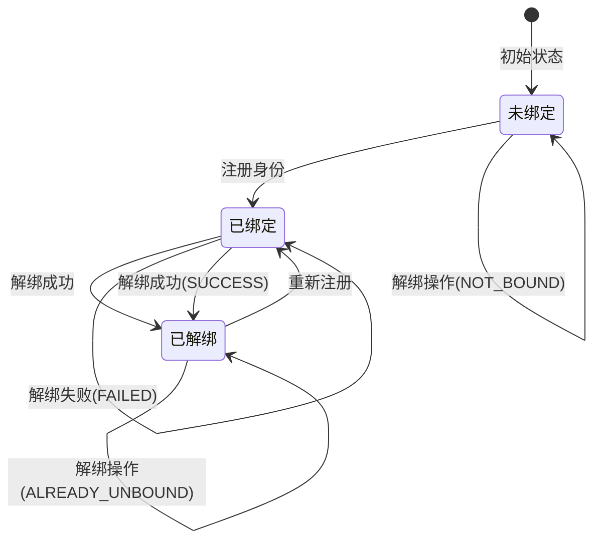

# 优化解绑接口返回信息

## 🔍 问题描述

用户反馈：当没有任何绑定时，重复调用解绑接口仍然返回"操作成功"，这会造成误解。用户期望在没有绑定时得到更明确的提示信息。

### 原始行为
```json
// 无论是否有绑定，都返回相同结果
{
    "code": 200,
    "msg": "操作成功",
    "data": null
}
```

## 🎯 优化目标

提供更准确、更有意义的API响应，让用户清楚了解操作的实际结果：

1. **解绑成功**：用户确实有绑定且成功解绑
2. **未绑定**：用户从未绑定过该身份
3. **已解绑**：用户已经处于解绑状态
4. **解绑失败**：操作过程中出现错误

## ✅ 解决方案

### 1. 创建解绑结果枚举

新建 `UnbindResult` 枚举来表示不同的解绑状态：

```java
@Getter
@AllArgsConstructor
public enum UnbindResult {
    SUCCESS("success", "解绑成功"),
    NOT_BOUND("not_bound", "用户未绑定该身份"),
    ALREADY_UNBOUND("already_unbound", "用户已经处于解绑状态"),
    FAILED("failed", "解绑失败");

    private final String code;
    private final String message;
}
```

### 2. 扩展Service接口

添加返回详细状态的解绑方法：

```java
/**
 * 解绑用户与实体（返回详细状态）
 */
UnbindResult unbindUserFromEntityWithResult(Long userId, UserEntityType entityType);
```

### 3. 实现详细状态检查

```java
@Override
public UnbindResult unbindUserFromEntityWithResult(Long userId, UserEntityType entityType) {
    // 查询包括所有状态的绑定记录
    UserBinding binding = userBindingMapper.selectByUserIdAndEntityTypeAllStatus(userId, entityType.getCode());
    
    if (binding == null) {
        // 用户从未绑定过该身份
        return UnbindResult.NOT_BOUND;
    }
    
    if ("0".equals(binding.getBindingStatus())) {
        // 用户已经处于解绑状态
        return UnbindResult.ALREADY_UNBOUND;
    }
    
    if ("1".equals(binding.getBindingStatus())) {
        // 执行解绑操作
        binding.setBindingStatus("0");
        if (updateById(binding)) {
            return UnbindResult.SUCCESS;
        } else {
            return UnbindResult.FAILED;
        }
    }
    
    // 未知状态，返回失败
    return UnbindResult.FAILED;
}
```

### 4. 优化Controller响应

修改解绑接口，根据不同状态返回相应信息：

```java
@PutMapping("/unbind/{entityType}")
public R<Void> unbindUserIdentity(@PathVariable String entityType) {
    Long userId = LoginHelper.getUserId();
    
    UserEntityType type = UserEntityType.getByCode(entityType);
    if (type == null) {
        return R.fail("无效的实体类型");
    }
    
    UnbindResult result = userBindingService.unbindUserFromEntityWithResult(userId, type);
    
    switch (result) {
        case SUCCESS:
            return R.ok("解绑成功");
        case NOT_BOUND:
            return R.fail("用户未绑定该身份，无需解绑");
        case ALREADY_UNBOUND:
            return R.fail("用户已经处于解绑状态");
        case FAILED:
        default:
            return R.fail("解绑失败");
    }
}
```

## 🔄 优化后的API行为

### 场景1：成功解绑
**用户状态**：已绑定设计师身份  
**操作**：`PUT /designer/user/unbind/designer`  
**响应**：
```json
{
    "code": 200,
    "msg": "解绑成功",
    "data": null
}
```

### 场景2：用户从未绑定
**用户状态**：从未绑定过设计师身份  
**操作**：`PUT /designer/user/unbind/designer`  
**响应**：
```json
{
    "code": 500,
    "msg": "用户未绑定该身份，无需解绑",
    "data": null
}
```

### 场景3：用户已经解绑
**用户状态**：之前绑定过但已解绑  
**操作**：`PUT /designer/user/unbind/designer`  
**响应**：
```json
{
    "code": 500,
    "msg": "用户已经处于解绑状态",
    "data": null
}
```

### 场景4：解绑失败
**用户状态**：有绑定但操作失败  
**操作**：`PUT /designer/user/unbind/designer`  
**响应**：
```json
{
    "code": 500,
    "msg": "解绑失败",
    "data": null
}
```

### 场景5：无效实体类型
**操作**：`PUT /designer/user/unbind/invalid_type`  
**响应**：
```json
{
    "code": 500,
    "msg": "无效的实体类型",
    "data": null
}
```

## 📋 状态转换图



## 🧪 测试用例

### 测试流程1：正常解绑流程
```bash
# 1. 注册设计师
POST /designer/user/register/designer
# 响应：{"code": 200, "msg": "操作成功"}

# 2. 首次解绑
PUT /designer/user/unbind/designer
# 预期：{"code": 200, "msg": "解绑成功"}

# 3. 重复解绑
PUT /designer/user/unbind/designer
# 预期：{"code": 500, "msg": "用户已经处于解绑状态"}

# 4. 验证绑定状态
GET /designer/user/bindings
# 预期：{"code": 200, "data": []}
```

### 测试流程2：从未绑定的解绑
```bash
# 1. 直接解绑（未注册过）
PUT /designer/user/unbind/designer
# 预期：{"code": 500, "msg": "用户未绑定该身份，无需解绑"}

# 2. 验证绑定状态
GET /designer/user/bindings
# 预期：{"code": 200, "data": []}
```

### 测试流程3：无效实体类型
```bash
# 1. 使用无效类型
PUT /designer/user/unbind/invalid_type
# 预期：{"code": 500, "msg": "无效的实体类型"}
```

## 📊 数据库状态对照

| 数据库状态 | 解绑操作结果 | API响应 |
|------------|-------------|---------|
| 无记录 | NOT_BOUND | "用户未绑定该身份，无需解绑" |
| binding_status = '1' | SUCCESS | "解绑成功" |
| binding_status = '0' | ALREADY_UNBOUND | "用户已经处于解绑状态" |
| 更新失败 | FAILED | "解绑失败" |

## ✅ 优化效果

### 用户体验改进
1. **清晰反馈**：用户明确知道操作的实际结果
2. **减少困惑**：不会在无绑定时误以为操作成功
3. **调试友好**：开发者可以根据不同状态进行相应处理

### API语义改进
1. **RESTful原则**：操作结果与实际状态一致
2. **幂等性说明**：重复操作时明确告知原因
3. **错误区分**：不同错误情况有不同的错误信息

### 系统健壮性
1. **状态检查**：在操作前检查当前状态
2. **异常处理**：处理各种边界情况
3. **日志记录**：操作日志更加准确

## 🔍 与其他接口的一致性

确保其他相关接口也有类似的清晰响应：

### 绑定状态查询
```json
// 有绑定时
{"code": 200, "msg": "查询成功", "data": [...]}

// 无绑定时
{"code": 200, "msg": "查询成功", "data": []}
```

### 身份信息查询
```json
// 有绑定时
{"code": 200, "msg": "查询成功", "data": {...}}

// 无绑定时
{"code": 500, "msg": "用户未绑定设计师身份", "data": null}
```

这种设计确保了整个API系统的一致性和用户友好性。 