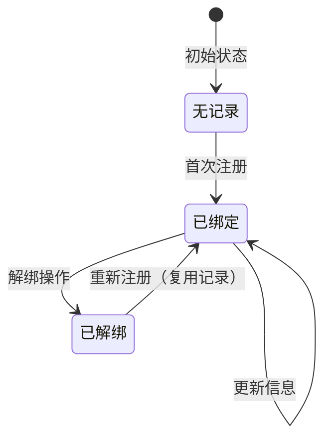

# 修复重新绑定唯一约束冲突问题

## 🔍 问题描述

用户在解绑设计师身份后，再次尝试注册设计师时遇到数据库唯一约束冲突错误：

```
SQLIntegrityConstraintViolationException: Duplicate entry '1933082743395094530-designer' 
for key 'des_user_binding.uk_user_entity'
```

## 🎯 问题根本原因

### 数据库设计
- `des_user_binding` 表有唯一约束 `uk_user_entity`，基于 `(user_id, entity_type)` 字段
- 解绑操作使用"软删除"：将 `binding_status` 从 `'1'` 更新为 `'0'`，但记录仍然存在

### 业务逻辑缺陷
1. **绑定检查逻辑问题**：
   ```java
   // 原逻辑：只查询 binding_status = '1' 的记录
   UserBinding existing = getBindingByUserIdAndEntityType(userId, entityType);
   if (existing != null) {
       // 更新现有记录
   } else {
       // 创建新记录 ← 这里有问题！
   }
   ```

2. **解绑后的状态**：
   - 查询 `binding_status = '1'` 返回 `null`
   - 系统认为没有绑定记录
   - 尝试创建新记录时违反唯一约束

## ✅ 解决方案

### 1. 新增查询方法

在 `UserBindingMapper` 中添加查询所有状态记录的方法：

```java
/**
 * 根据用户ID和实体类型查询绑定关系（包括所有状态）
 */
@Select("SELECT * FROM des_user_binding WHERE user_id = #{userId} AND entity_type = #{entityType}")
UserBinding selectByUserIdAndEntityTypeAllStatus(@Param("userId") Long userId, @Param("entityType") String entityType);
```

### 2. 修改绑定逻辑

更新 `UserBindingServiceImpl.bindUserToEntity` 方法：

```java
@Override
public Boolean bindUserToEntity(Long userId, UserEntityType entityType, Long entityId) {
    // 先检查是否已经存在绑定关系（包括所有状态）
    UserBinding existing = userBindingMapper.selectByUserIdAndEntityTypeAllStatus(userId, entityType.getCode());
    if (existing != null) {
        // 如果已存在记录，更新绑定状态和实体ID（重新激活绑定）
        existing.setEntityId(entityId);
        existing.setBindingStatus("1");
        return updateById(existing);
    }
    
    // 创建新的绑定关系
    UserBinding binding = new UserBinding();
    binding.setUserId(userId);
    binding.setEntityType(entityType.getCode());
    binding.setEntityId(entityId);
    binding.setBindingStatus("1");
    
    return save(binding);
}
```

### 3. 优化注册逻辑

修改注册接口，支持重新激活已解绑的设计师：

```java
@PostMapping("/register/designer")
public R<Void> registerDesigner(@Validated @RequestBody Designer designer) {
    Long userId = LoginHelper.getUserId();
    
    // 检查用户是否已经绑定了设计师（只检查有效绑定）
    if (userBindingService.isUserBoundToEntityType(userId, UserEntityType.DESIGNER)) {
        return R.fail("用户已绑定设计师身份");
    }
    
    // 检查是否有历史绑定记录（包括解绑状态）
    UserBinding existingBinding = userBindingService.getBindingByUserIdAndEntityTypeAllStatus(userId, UserEntityType.DESIGNER);
    if (existingBinding != null && "0".equals(existingBinding.getBindingStatus())) {
        // 如果有解绑记录，更新现有设计师信息并重新激活绑定
        Long existingDesignerId = existingBinding.getEntityId();
        Designer existingDesigner = designerService.selectDesignerById(existingDesignerId);
        if (existingDesigner != null) {
            // 更新设计师信息
            designer.setDesignerId(existingDesignerId);
            designer.setUserId(userId);
            if (designerService.updateDesigner(designer)) {
                // 重新激活绑定关系
                userBindingService.bindUserToEntity(userId, UserEntityType.DESIGNER, existingDesignerId);
                return R.ok();
            }
        }
    }
    
    // 设置用户ID
    designer.setUserId(userId);
    
    // 保存设计师信息
    if (designerService.insertDesigner(designer)) {
        // 创建用户绑定关系
        userBindingService.bindUserToEntity(userId, UserEntityType.DESIGNER, designer.getDesignerId());
        return R.ok();
    }
    
    return R.fail("注册失败");
}
```

### 4. 改进解绑逻辑

确保解绑操作的一致性：

```java
@Override
public Boolean unbindUserFromEntity(Long userId, UserEntityType entityType) {
    // 查询包括所有状态的绑定记录
    UserBinding binding = userBindingMapper.selectByUserIdAndEntityTypeAllStatus(userId, entityType.getCode());
    if (binding != null && "1".equals(binding.getBindingStatus())) {
        // 只有当前状态为绑定时才执行解绑操作
        binding.setBindingStatus("0");
        return updateById(binding);
    }
    return true;
}
```

## 🔄 修复后的完整流程

### 场景1：首次注册设计师
1. 用户调用 `/designer/user/register/designer`
2. 检查无任何绑定记录
3. 创建新的设计师记录和绑定关系
4. 成功返回

### 场景2：解绑后重新注册
1. 用户之前已解绑设计师身份（`binding_status = '0'`）
2. 用户调用 `/designer/user/register/designer`
3. 检查发现有解绑状态的历史记录
4. 更新现有设计师信息
5. 重新激活绑定关系（`binding_status = '1'`）
6. 成功返回

### 场景3：已绑定状态下注册
1. 用户已有有效绑定（`binding_status = '1'`）
2. 用户调用 `/designer/user/register/designer`
3. 返回"用户已绑定设计师身份"错误
4. 保护现有绑定不被意外覆盖

## 📊 数据流转状态

### 绑定记录生命周期



### 数据库状态变化

| 操作 | binding_status | 记录数量 | 说明 |
|------|----------------|----------|------|
| 首次注册 | '1' | 1 | 创建新记录 |
| 解绑 | '0' | 1 | 软删除，记录保留 |
| 重新注册 | '1' | 1 | 复用记录，更新状态 |

## 🚀 测试验证

### 1. 完整测试流程

```bash
# 1. 首次注册设计师
POST /designer/user/register/designer
{
    "designerName": "张三",
    "profession": "UI_DESIGNER",
    "email": "zhangsan@example.com",
    "phone": "13800138000",
    "skillTags": "[\"PROTOTYPE_DESIGN\", \"VISUAL_DESIGN\"]",
    "description": "专业UI设计师"
}

# 2. 解绑设计师身份
PUT /designer/user/unbind/designer

# 3. 重新注册设计师（应该成功）
POST /designer/user/register/designer
{
    "designerName": "张三-更新",
    "profession": "INTERACTION_DESIGNER",
    "email": "zhangsan.new@example.com",
    "phone": "13800138001",
    "skillTags": "[\"INTERACTION_DESIGN\", \"USER_RESEARCH\"]",
    "description": "资深交互设计师"
}
```

### 2. 数据库验证

```sql
-- 查看绑定记录状态
SELECT 
    binding_id,
    user_id,
    entity_type,
    entity_id,
    binding_status,
    CASE binding_status 
        WHEN '1' THEN '已绑定'
        WHEN '0' THEN '已解绑'
    END AS status_desc,
    create_time,
    update_time
FROM des_user_binding 
WHERE user_id = {您的用户ID} 
AND entity_type = 'designer'
ORDER BY update_time DESC;

-- 查看设计师信息变化
SELECT 
    designer_id,
    user_id,
    designer_name,
    profession,
    email,
    phone,
    skill_tags,
    description,
    create_time,
    update_time
FROM des_designer 
WHERE user_id = {您的用户ID}
ORDER BY update_time DESC;
```

### 3. 预期结果

#### 绑定记录
- **记录数量**：始终只有1条记录
- **状态变化**：'1' → '0' → '1'
- **时间戳**：`update_time` 反映最新操作时间

#### 设计师记录
- **记录ID**：保持不变（复用现有记录）
- **信息更新**：反映最新提交的设计师信息
- **时间戳**：`update_time` 更新为重新注册时间

## ✅ 修复完成

现在系统支持：

1. ✅ **首次注册**：创建新的设计师和绑定记录
2. ✅ **正常解绑**：软删除绑定关系
3. ✅ **重新注册**：复用现有记录，避免唯一约束冲突
4. ✅ **信息更新**：重新注册时更新设计师详细信息
5. ✅ **状态管理**：正确处理绑定状态的转换

这种设计既解决了唯一约束冲突问题，又保持了数据的一致性和完整性。 